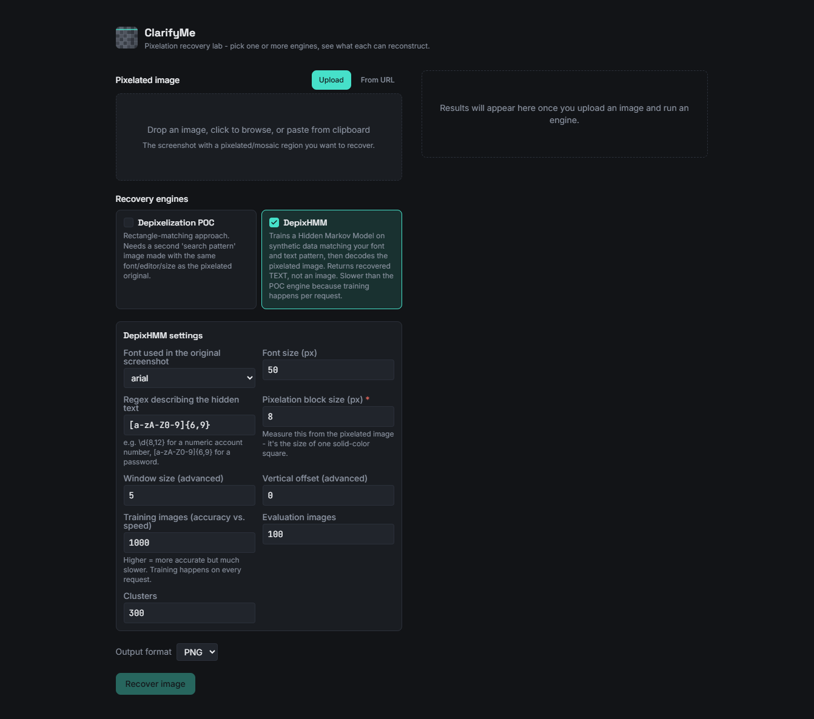
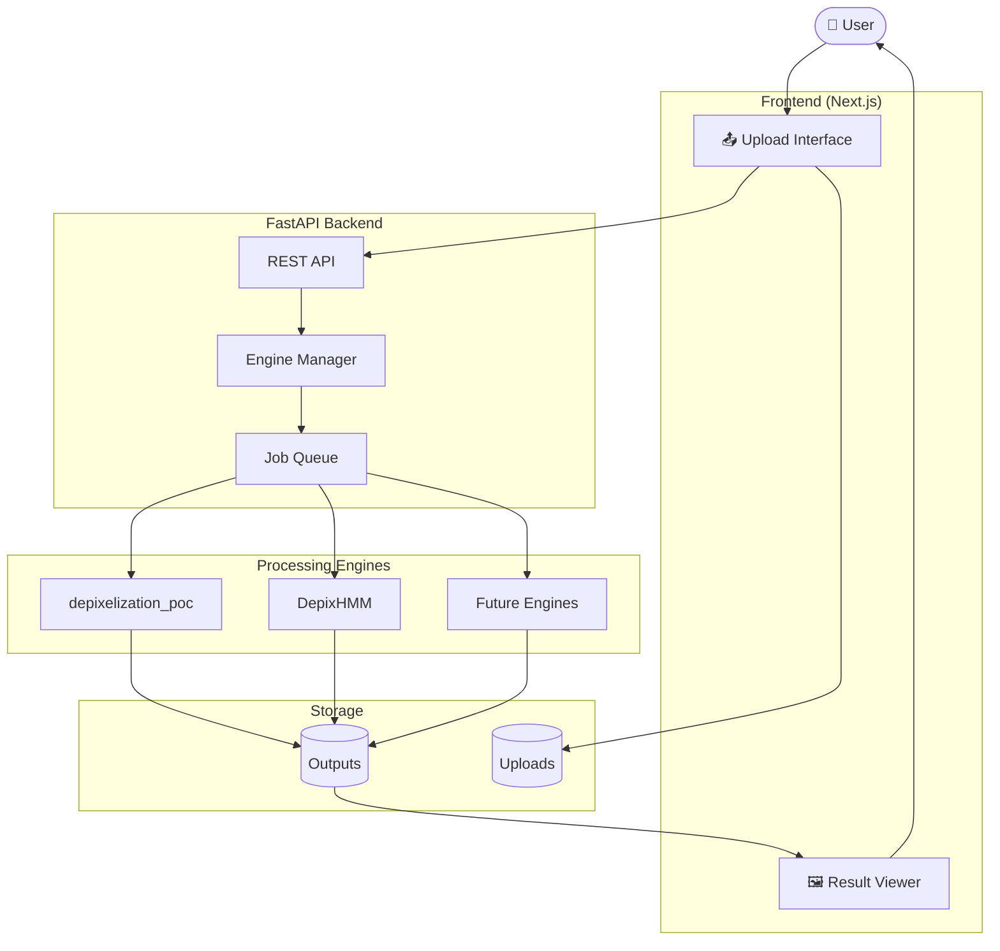
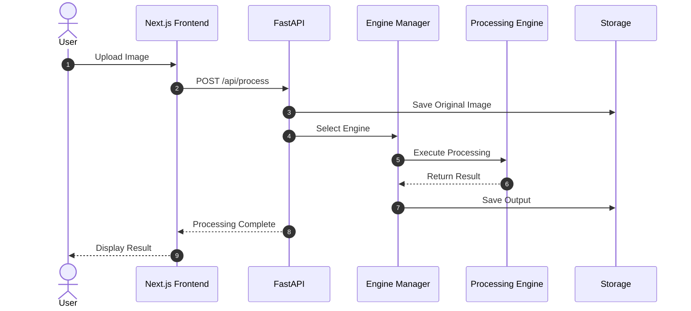
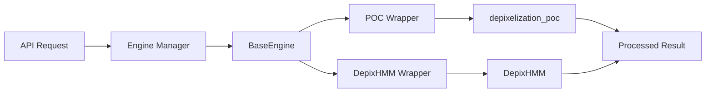
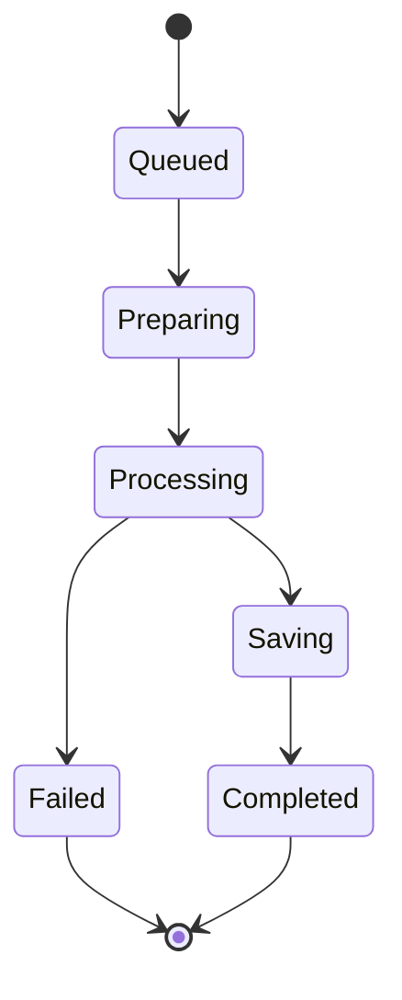
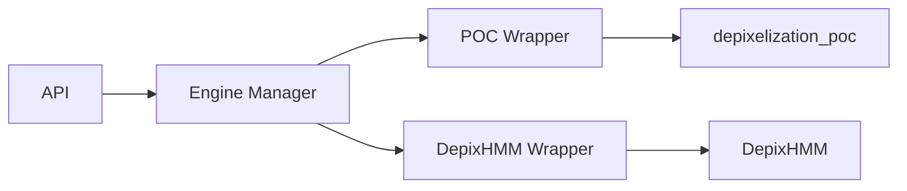

<div align="center">


# ClarifyMe

### Unified Image Restoration Platform

**Recover pixelated text, compare multiple restoration engines, and experiment with image reconstruction through a single, modern interface.**

<p align="center">


</p>

<p align="center">

<a href="#features">Features</a> •
<a href="#architecture">Architecture</a> •
<a href="#installation">Installation</a> •
<a href="#documentation">Documentation</a> •
<a href="#roadmap">Roadmap</a> •
<a href="#license">License</a>

</p>

</div>

---

> **ClarifyMe** is an extensible image restoration platform that brings multiple depixelization and reconstruction engines together under one consistent workflow.

Instead of cloning separate repositories, learning different command-line interfaces, and manually comparing results, ClarifyMe provides a unified web experience where you can:

- Upload an image
- Choose one or more restoration engines
- Compare outputs side-by-side
- Analyze processing results
- Download restored images
- Easily extend the platform with additional engines

Whether you're researching depixelization techniques, evaluating restoration algorithms, or building new image-processing workflows, ClarifyMe provides a common foundation that keeps the user experience consistent while allowing the underlying processing engines to evolve independently.

---

# ✨ Why ClarifyMe?

Traditional image restoration workflows often require managing multiple repositories, each with different dependencies, setup instructions, command-line interfaces, and output formats.

ClarifyMe removes that complexity by introducing a standardized processing layer that allows multiple engines to coexist behind a unified API.

| Traditional Workflow | ClarifyMe |
|----------------------|-----------|
| Clone multiple repositories | One platform |
| Learn multiple CLIs | Unified web interface |
| Separate dependencies | Centralized backend |
| Compare outputs manually | Built-in comparison tools |
| Different APIs | Common engine interface |
| Difficult to extend | Plugin-ready architecture |

---

# 📸 Preview

<p align="center">



</p>

---

# Features

### Image Input

- Drag & Drop upload
- Clipboard paste
- Local file upload
- URL import
- Multiple image support *(planned)*

---

### Processing Engines

- depixelization_poc
- DepixHMM
- Multiple engine execution
- Side-by-side comparison
- Plugin-based architecture
- Future engine support

---

### Results

- Original vs Restored comparison
- Before / After slider
- Multiple output comparison
- Download processed images
- Processing metadata
- Execution logs

---

### Platform

- Modern Next.js frontend
- FastAPI backend
- Async processing
- Docker deployment
- Responsive UI
- REST API
- Extensible architecture

---

# 🎯 Vision

ClarifyMe is designed to become more than a depixelization frontend.

The long-term goal is to build a modular image restoration platform capable of integrating a wide variety of reconstruction algorithms through a common plugin architecture.

Potential future engine categories include:

- Depixelization
- Deblurring
- Super Resolution
- OCR Enhancement
- Noise Reduction
- Compression Artifact Removal
- AI-based Restoration
- Custom Research Models

---

<a id="architecture"></a>

# 🏗 Architecture

ClarifyMe follows a modular architecture that separates the user interface from image processing engines. Each engine is treated as an independent module, allowing new algorithms to be integrated without modifying the frontend.


---

# ⚙ Request Lifecycle

Every request follows the same processing pipeline regardless of which restoration engine is selected.



---

# 🔌 Engine System

The backend is designed around a plugin architecture.

Every processing engine implements the same interface.



Because every engine follows the same contract, ClarifyMe can support new restoration algorithms without changing the frontend.

---

## Engine Interface

```python
from abc import ABC, abstractmethod

class BaseEngine(ABC):

    @abstractmethod
    def process(
        self,
        input_path: str,
        output_path: str,
        options: dict,
    ):
        pass
```

---

## Current Engines

| Engine | Description | Status |
|---------|-------------|--------|
| **depixelization_poc** | Pattern-matching depixelization using De Bruijn search images | ✅ Stable |
| **DepixHMM** | Hidden Markov Model based reconstruction engine | ✅ Stable |
| **Future Plugins** | Custom restoration engines implementing `BaseEngine` | 🚧 Planned |

---

# 📂 Repository Structure

```text
ClarifyMe
│
├── backend
│   ├── api
│   │   ├── routes.py
│   │   └── schemas.py
│   │
│   ├── engines
│   │   ├── base.py
│   │   ├── manager.py
│   │   ├── poc.py
│   │   └── depixhmm.py
│   │
│   ├── wrappers
│   │   ├── poc.py
│   │   └── depixhmm.py
│   │
│   ├── workers
│   ├── models
│   ├── utils
│   ├── uploads
│   ├── outputs
│   ├── logs
│   └── main.py
│
├── frontend
│   ├── app
│   ├── components
│   ├── hooks
│   ├── lib
│   ├── services
│   ├── styles
│   └── public
│
├── docs
│   ├── architecture.md
│   ├── api.md
│   ├── engines.md
│   ├── contributing.md
│   └── assets
│
├── docker
│
├── Dockerfile.backend
├── Dockerfile.frontend
├── docker-compose.yml
│
├── LICENSE
├── CONTRIBUTING.md
├── CHANGELOG.md
└── README.md
```

---

# 📦 Project Philosophy

ClarifyMe is organized around a simple principle:

> **The frontend should never know how an engine works.**

Instead, every restoration engine behaves like a black box.

The frontend submits a request.

The backend selects an engine.

The engine processes the image.

The frontend simply displays the result.

This separation keeps the application scalable, maintainable, and easy to extend.

---

# 🧠 Design Principles

| Principle | Description |
|-----------|-------------|
| **Engine Independence** | Engines remain isolated from the web application. |
| **Plugin Architecture** | New algorithms require only a new engine implementation. |
| **Consistent API** | Every engine exposes the same processing interface. |
| **Async First** | Long-running tasks should never block the UI. |
| **Developer Experience** | Clear abstractions over clever implementations. |
| **Extensibility** | The project is built to grow beyond depixelization. |

---

<a id="technology-stack"></a>

# ⚡ Technology Stack

ClarifyMe combines a modern React-based frontend with a high-performance Python backend designed for computational image processing.

| Layer | Technology | Purpose |
|--------|------------|---------|
| **Frontend** | Next.js 16 | Application framework |
| **Language** | TypeScript | Type-safe frontend development |
| **UI** | React 19 | Component-based interface |
| **Styling** | Tailwind CSS | Utility-first styling |
| **Components** | shadcn/ui | Accessible UI components |
| **State Management** | TanStack Query | Server state & caching |
| **Backend** | FastAPI | REST API |
| **Language** | Python 3.12+ | Image processing |
| **Image Libraries** | OpenCV, Pillow, NumPy | Core processing |
| **Validation** | Pydantic | Request validation |
| **Containerization** | Docker | Portable deployment |
| **Reverse Proxy** | Nginx *(optional)* | Production deployment |

---

# 🧩 Processing Engines

Unlike traditional applications that rely on a single algorithm, ClarifyMe is built around interchangeable **Processing Engines**.

Each engine specializes in a different reconstruction strategy while exposing a common interface to the application.

| Engine | Description | Status |
|---------|-------------|--------|
| **depixelization_poc** | Pattern-matching reconstruction using De Bruijn search images | ✅ Supported |
| **DepixHMM** | Hidden Markov Model based character reconstruction | ✅ Supported |
| **Custom Engines** | Third-party implementations following the `BaseEngine` interface | 🚧 Planned |

---

## Engine Comparison

| Capability | depixelization_poc | DepixHMM |
|------------|--------------------|----------|
| Pixelated text recovery | ✅ | ✅ |
| Pattern matching | ✅ | ❌ |
| Hidden Markov Models | ❌ | ✅ |
| Plugin compatible | ✅ | ✅ |
| Unified API | ✅ | ✅ |

---

## ⚙ Multi-Engine Processing

Run one engine—or many.

```text
○ depixelization_poc

○ DepixHMM

☑ Run All Engines
```

ClarifyMe automatically manages execution and returns results in a consistent format.

---

## 🖼 Rich Result Viewer

Every processed image includes:

- Original image
- Restored image
- Side-by-side comparison
- Download
- Metadata
- Processing time
- Selected engine

Future releases will include:

- Interactive comparison slider
- Zoom synchronization
- Pixel inspector
- OCR preview

---

## 📊 Compare Algorithms

One of ClarifyMe's primary goals is helping developers compare restoration techniques.

```text
                Original

+-------------------------------+

POC Result          DepixHMM Result

+-------------+     +-------------+

Future Engine       Custom Engine

+-------------+     +-------------+
```

Instead of replacing one engine with another, ClarifyMe encourages evaluating multiple approaches using the same input.

---

# 🌍 Use Cases

ClarifyMe is useful for a variety of workflows.

| Use Case | Description |
|----------|-------------|
| Research | Compare multiple depixelization algorithms |
| Education | Demonstrate image reconstruction techniques |
| Development | Build and test new processing engines |
| Benchmarking | Evaluate output quality across engines |
| Experimentation | Prototype restoration pipelines |

---

<a id="installation"></a>

# Getting Started

ClarifyMe consists of two primary applications:

| Application | Description |
|-------------|-------------|
| **Frontend** | Next.js application providing the user interface |
| **Backend** | FastAPI service responsible for image processing and engine execution |

The frontend communicates with the backend through a REST API, while the backend manages uploads, processing engines, job execution, and result generation.

---

# 📋 Prerequisites

Before running ClarifyMe locally, ensure the following software is installed.

| Software | Version |
|-----------|---------|
| Python | 3.12+ |
| Node.js | 20+ |
| npm | 10+ |
| Git | Latest |
| Docker *(optional)* | Latest |

---

# ⚡ Clone Repository

```bash
git clone https://github.com/YOUR_USERNAME/ClarifyMe.git

cd ClarifyMe
```

---

# 🖥 Backend Setup

Navigate to the backend.

```bash
cd backend
```

Create a virtual environment.

```bash
python -m venv .venv
```

Activate it.

### Windows

```bash
.venv\Scripts\activate
```

### Linux / macOS

```bash
source .venv/bin/activate
```

Install dependencies.

```bash
pip install -r requirements.txt
```

Start the API server.

```bash
uvicorn main:app --reload
```

By default the backend will be available at

```
http://localhost:8000
```

---

# 🌐 Frontend Setup

Open another terminal.

```bash
cd frontend
```

Install dependencies.

```bash
npm install
```

Copy the environment template.

```bash
cp .env.local.example .env.local
```

Run the development server.

```bash
npm run dev
```

The frontend will be available at

```
http://localhost:3000
```

---

# 🔑 Environment Variables

## Frontend

Create

```
frontend/.env.local
```

```env
NEXT_PUBLIC_API_URL=http://localhost:8000
```

---

## Backend

Create

```
backend/.env
```

Example

```env
HOST=0.0.0.0

PORT=8000

DEBUG=True

UPLOAD_DIRECTORY=uploads

OUTPUT_DIRECTORY=outputs
```

---

# 🐳 Docker

ClarifyMe ships with Docker support for running the complete application stack.

Build everything.

```bash
docker compose build
```

Start services.

```bash
docker compose up
```

Run in detached mode.

```bash
docker compose up -d
```

Stop services.

```bash
docker compose down
```

Rebuild containers.

```bash
docker compose up --build
```

---

# 📂 Docker Services

| Service | Purpose |
|----------|---------|
| frontend | Next.js application |
| backend | FastAPI API |
| nginx *(optional)* | Reverse proxy |

---

# 🚦 Verify Installation

Open

```
http://localhost:3000
```

Upload any image.

Choose a processing engine.

Click **Process**.

If everything is configured correctly, the processed image should appear within a few moments.

---

# 🛠 Development Workflow

The recommended workflow for contributors is:

```
git pull

↓

Create Feature Branch

↓

Implement Feature

↓

Run Tests

↓

Commit

↓

Open Pull Request
```

---

# 🧪 Running Tests

Backend

```bash
pytest
```

Frontend

```bash
npm test
```

Run linting.

```bash
npm run lint
```

Format code.

```bash
npm run format
```

---

# 📦 Build Production

Frontend

```bash
npm run build
```

Backend

```bash
uvicorn main:app
```

Docker

```bash
docker compose up --build -d
```

---

# 🌐 Production Deployment

ClarifyMe can be deployed using a variety of environments.

| Platform | Supported |
|----------|-----------|
| Docker | ✅ |
| DigitalOcean | ✅ |
| Railway | ✅ |
| Render | ✅ |
| AWS EC2 | ✅ |
| Azure VM | ✅ |
| Google Cloud | ✅ |
| Self-hosted Linux | ✅ |

For production deployments we recommend:

- Docker Compose
- Nginx
- HTTPS via Let's Encrypt
- Persistent upload storage
- Dedicated output directory
- Reverse proxy configuration

---

<a id="api"></a>

# 📡 REST API

ClarifyMe exposes a simple REST API that allows applications, scripts, and third-party tools to interact with the image processing pipeline.

The API is designed to remain independent of individual processing engines, providing a consistent interface regardless of which algorithm performs the restoration.

Base URL

```
http://localhost:8000/api
```

---

# Authentication

Currently, authentication is **not required** for local development.

Future releases will support:

- API Keys
- JWT Authentication
- OAuth Providers
- Rate Limiting

---

# Process Image

Starts a new processing job.

```http
POST /api/process
```

### Request

```json
{
  "engines": [
    "depixelization_poc",
    "depixhmm"
  ],
  "options": {
    "output_format": "png"
  }
}
```

### Form Data

| Field | Type | Required | Description |
|--------|------|----------|-------------|
| image | File | ✅ | Uploaded image |
| engines | Array | ✅ | Selected processing engines |
| options | JSON | ❌ | Engine-specific configuration |

---

### Response

```json
{
  "job_id": "cb19b75f",
  "status": "queued",
  "message": "Processing started."
}
```

---

# Job Status

Retrieve the status of a running job.

```http
GET /api/jobs/{job_id}
```

Example

```http
GET /api/jobs/cb19b75f
```

Response

```json
{
  "job_id":"cb19b75f",
  "status":"running",
  "progress":63
}
```

Possible status values

| Status | Description |
|---------|-------------|
| queued | Waiting for execution |
| preparing | Upload validation |
| processing | Engine execution |
| completed | Successfully finished |
| failed | Processing failed |

---

# Retrieve Results

```http
GET /api/results/{job_id}
```

Response

```json
{
  "job_id":"cb19b75f",
  "results":[
    {
      "engine":"depixelization_poc",
      "image":"outputs/poc.png"
    },
    {
      "engine":"depixhmm",
      "image":"outputs/hmm.png"
    }
  ]
}
```

---

# Download Result

```http
GET /api/download/{job_id}/{engine}
```

Example

```
GET /api/download/cb19b75f/depixhmm
```

Returns

```
image/png
```

---

# Error Responses

Every endpoint follows a consistent error format.

```json
{
    "error": true,
    "message": "Invalid image format.",
    "code": 400
}
```

---

# Processing Lifecycle

Every request follows the same lifecycle.



---

# ⚙ Engine Architecture

ClarifyMe treats every restoration algorithm as a **Processing Engine**.

The application itself never communicates directly with repository code.

Instead, every engine is wrapped behind a common interface.



This architecture ensures that adding new engines requires minimal changes to the existing application.

---

# Base Engine Interface

Every processing engine inherits from a common interface.

```python
from abc import ABC, abstractmethod

class BaseEngine(ABC):

    @abstractmethod
    def process(
        self,
        input_path: str,
        output_path: str,
        options: dict
    ):
        """
        Execute the processing engine.
        """
        pass
```

---

# Creating a New Engine

Create a new file inside

```
backend/engines/
```

Example

```python
from engines.base import BaseEngine

class MyEngine(BaseEngine):

    def process(self, input_path, output_path, options):

        ...
```

Register it inside the Engine Manager.

```python
ENGINES = {

    "depixelization_poc": POCEngine(),

    "depixhmm": DepixHMMEngine(),

    "myengine": MyEngine(),

}
```

The new engine immediately becomes available through the API and frontend.

---

# 📈 Future Engine Ideas

ClarifyMe is intentionally designed to support more than depixelization.

Potential future engines include:

| Category | Example |
|----------|---------|
| Super Resolution | Real-ESRGAN |
| Face Restoration | GFPGAN |
| Deblurring | DeblurGAN |
| OCR Enhancement | PaddleOCR |
| AI Upscaling | SwinIR |
| Denoising | BM3D |
| Compression Artifact Removal | JPEG AI |
| Research Models | Custom plugins |

---

# 🧪 Testing

Backend

```bash
pytest
```

Frontend

```bash
npm test
```

Type Checking

```bash
npm run type-check
```

Linting

```bash
npm run lint
```

Formatting

```bash
npm run format
```

---

# 📚 Documentation

Additional documentation is available in the `/docs` directory.

| Document | Description |
|----------|-------------|
| architecture.md | System architecture |
| backend.md | Backend internals |
| frontend.md | Frontend architecture |
| engines.md | Processing engine guide |
| deployment.md | Production deployment |
| api.md | Complete REST API |
| contributing.md | Contribution guide |
| troubleshooting.md | Common issues |

---

<a id="roadmap"></a>

# 🗺 Roadmap

ClarifyMe is under active development. The roadmap below outlines the current direction of the project.

## Version 1.x

### Platform

- [x] Modern Next.js frontend
- [x] FastAPI backend
- [x] Multi-engine architecture
- [x] Unified processing interface
- [x] Docker support
- [x] Plugin-ready engine system

### User Experience

- [x] Drag & Drop upload
- [x] Clipboard paste
- [x] URL image import
- [x] Side-by-side comparison
- [ ] Before / After comparison slider
- [ ] Batch processing
- [ ] Multiple image uploads
- [ ] Processing history

### Processing

- [x] depixelization_poc
- [x] DepixHMM
- [ ] Engine presets
- [ ] Engine benchmarking
- [ ] Output quality metrics

---

## Version 2.x

- [ ] User accounts
- [ ] Project workspaces
- [ ] Cloud processing
- [ ] GPU workers
- [ ] Queue management
- [ ] Shared result links
- [ ] Image collections
- [ ] Team collaboration

---

## Version 3.x

- [ ] AI-based restoration engines
- [ ] OCR pipeline
- [ ] Plugin marketplace
- [ ] REST API authentication
- [ ] GraphQL API
- [ ] Desktop application
- [ ] CLI
- [ ] Python SDK

---

# 🤝 Contributing

Contributions of every size are welcome.

Whether you're fixing a typo, improving the UI, optimizing an engine wrapper, or implementing a completely new processing engine, we'd love your contribution.

## Getting Started

```bash
git checkout -b feature/amazing-feature
```

Make your changes.

Run formatting.

```bash
npm run lint

npm run format

pytest
```

Commit.

```bash
git commit -m "feat: add amazing feature"
```

Push.

```bash
git push origin feature/amazing-feature
```

Open a Pull Request.

---

## Pull Request Checklist

Before opening a PR, please verify:

- [ ] Code builds successfully
- [ ] Tests pass
- [ ] Linting passes
- [ ] Documentation updated
- [ ] No unnecessary files committed
- [ ] Changes are focused on a single feature

---

# 💡 Development Philosophy

ClarifyMe favors:

- Simplicity over cleverness
- Explicit interfaces over hidden behavior
- Modular architecture over tightly coupled systems
- Maintainability over shortcuts
- Developer experience over unnecessary complexity

Every processing engine should behave like a self-contained plugin.

The frontend should never require changes when a new engine is introduced.

---

# Documentation

Complete documentation is available inside the `docs/` directory.

| Guide | Description |
|--------|-------------|
| architecture.md | System architecture |
| backend.md | Backend internals |
| frontend.md | Frontend architecture |
| api.md | REST API |
| engines.md | Engine development guide |
| deployment.md | Production deployment |
| troubleshooting.md | Common issues |
| contributing.md | Contribution guidelines |

---

# ❓ Frequently Asked Questions

## Why another depixelization project?

ClarifyMe is **not** another depixelization algorithm.

It is a platform that provides a unified interface for multiple restoration engines.

---

## Can I add my own engine?

Yes.

Any engine implementing the `BaseEngine` interface can be registered with the Engine Manager and immediately exposed through the API.

---

## Does ClarifyMe modify the original repositories?

No.

ClarifyMe wraps external processing engines behind a consistent interface without changing their public behavior.

---

## Can multiple engines run together?

Yes.

Users can execute one or more engines simultaneously and compare the outputs side-by-side.

---

## Is Docker required?

No.

ClarifyMe can run directly using Python and Node.js or through Docker Compose.

---

## Which operating systems are supported?

Development and deployment have been designed with cross-platform compatibility in mind.

- Windows
- Linux
- macOS

---

# 🙏 Acknowledgements

ClarifyMe would not be possible without the incredible work of the open-source community.

Special thanks to the authors and contributors of:

- **depixelization_poc**
- **DepixHMM**
- **FastAPI**
- **Next.js**
- **OpenCV**
- **Pillow**
- **NumPy**
- **Tailwind CSS**
- **shadcn/ui**

Their work made this project possible.

---

# License

ClarifyMe is released under the **MIT License**.

See the `LICENSE` file for details.

---

# ⭐ Support the Project

If ClarifyMe helps your research, workflow, or development, consider giving the repository a ⭐ on GitHub.

It helps others discover the project and motivates future development.

---

<div align="center">

## Built with ❤️ for the Open Source Community

**ClarifyMe** • Unified Image Restoration Platform

*Recover • Compare • Restore*

</div>